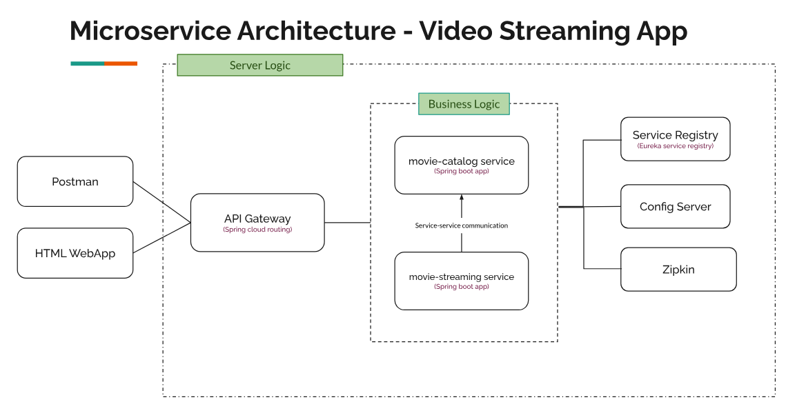
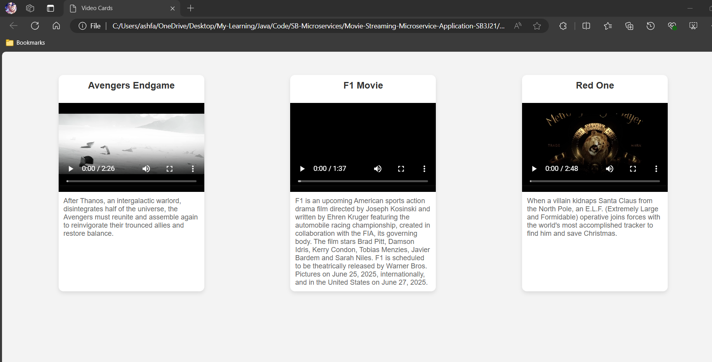
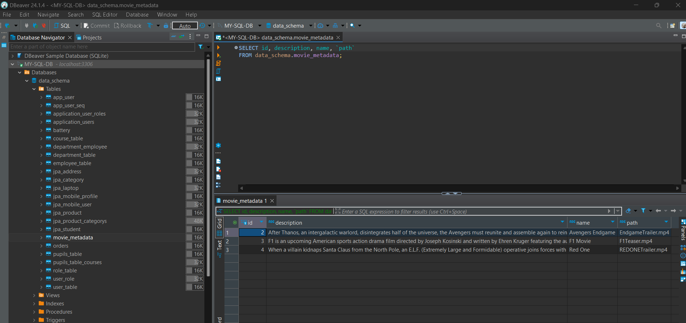

## VideoStreaming-Microservices-using-SpringBoot3




### UI View




## DB load 



## Actual movie data 


Note :to use spring cloud dependencies check out the spring cloud support version https://spring.io/projects/spring-cloud

eg : 

```
-- Eureka server 
<dependency>
			<groupId>org.springframework.cloud</groupId>
			<artifactId>spring-cloud-starter-netflix-eureka-client</artifactId>
		</dependency>


<properties>
		<java.version>21</java.version>
		<spring-cloud.version>2023.0.3</spring-cloud.version>
	</properties>


        <dependencyManagement>
		<dependencies>
			<dependency>
				<groupId>org.springframework.cloud</groupId>
		<artifactId>spring-cloud-dependencies</artifactId>
		<version>${spring-cloud.version}</version>
				<type>pom</type>
				<scope>import</scope>
			</dependency>
		</dependencies>
	</dependencyManagement>


```