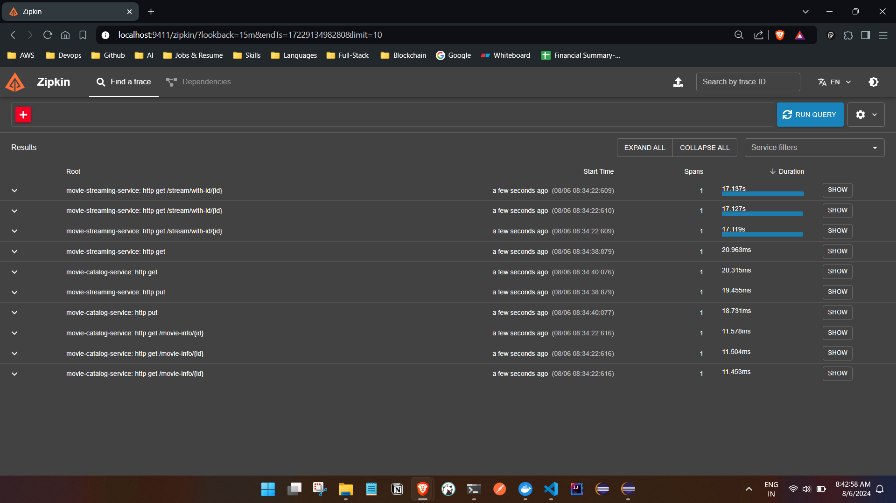
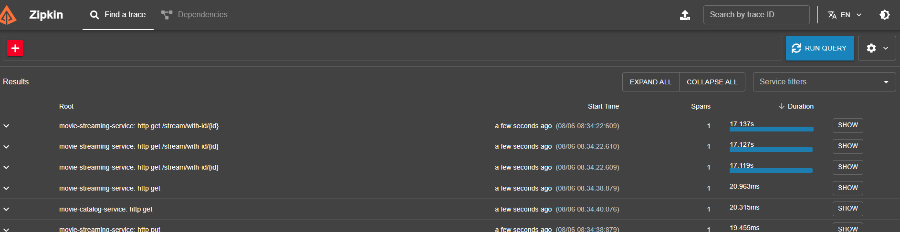
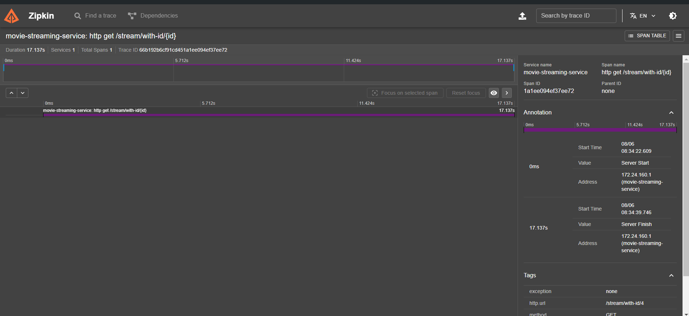

# Zipkin Overview

- Zipkin is a distributed tracing system that helps gather timing data needed to troubleshoot latency problems in service architectures. It manages the collection and lookup of this data and provides valuable insights into the behavior and performance of microservices.

- Key Responsibilities of Zipkin
1. Tracing Requests: Tracks the path of requests as they traverse various microservices.
2. Collecting Timing Data: Gathers data on the time taken for each segment of a request.
3. Visualizing Traces: Provides a UI to visualize the traces and understand the flow of requests.
4. Diagnosing Latency Issues: Helps identify slow microservices or problematic areas in the architecture.

- Why Use Zipkin?
1. Performance Monitoring: Helps monitor the performance of microservices.
2. Latency Troubleshooting: Assists in identifying and diagnosing latency issues.
3. Dependency Analysis: Shows the dependencies between microservices.
4. Request Path Tracking: Visualizes the path of a request through the system.

- How Zipkin Works
1. Instrumentation: Microservices are instrumented to generate tracing data. This can be done using libraries that support Zipkin, such as Brave (Java), Zipkin-js (JavaScript), or others.
2. Span Creation: As requests flow through services, spans are created. A span represents a single unit of work, such as an HTTP request.
3. Span Reporting: Spans are reported to the Zipkin server, which stores them.
4. Trace Aggregation: The Zipkin server aggregates spans into traces. A trace represents a complete request as it flows through various services.
5. UI Visualization: Zipkin provides a web UI to query and visualize traces.


### Setting Up Zipkin
- Instrumenting a Spring Boot Application


```

- Add Dependencies: Add the necessary dependencies to your Spring Boot project.

 <dependency>
      <groupId>org.springframework.boot</groupId>
      <artifactId>spring-boot-starter-actuator</artifactId>
    </dependency>
    <dependency>
      <groupId>io.micrometer</groupId>
      <artifactId>micrometer-tracing-bridge-brave</artifactId>
    </dependency>
    <dependency>
      <groupId>io.zipkin.reporter2</groupId>
      <artifactId>zipkin-reporter-brave</artifactId>
    </dependency>

- Add the config  in application.prop file or the config server respective service prop file 


#1 means 100% all the logs will be sent to zipkin
management.tracing.sampling.probability=1


```

### Run the Zipkin tool 
 link - https://zipkin.io/pages/quickstart.html

```

Docker
The Docker Zipkin project is able to build docker images, provide scripts and a docker-compose.yml for launching pre-built images. The quickest start is to run the latest image directly:

docker run -d -p 9411:9411 openzipkin/zipkin

OR 


Java
If you have Java 17 or higher installed, the quickest way to get started is to fetch the latest release as a self-contained executable jar:

curl -sSL https://zipkin.io/quickstart.sh | bash -s
java -jar zipkin.jar


```


- Run the application and test out the api's so the api are getting called and open the zipkin tool 







