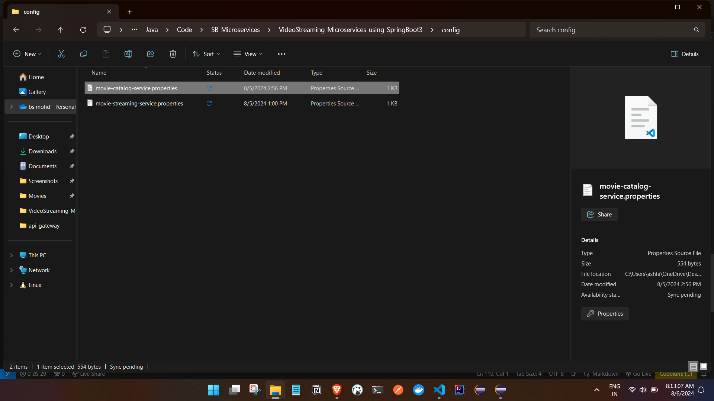
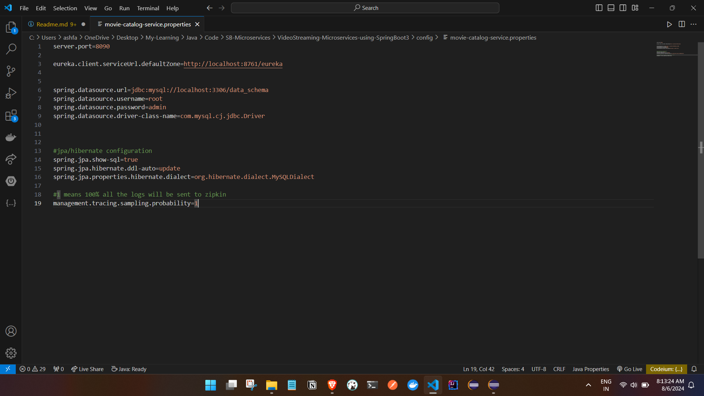

# Config Server 

- Centralizing the configuration for the services
- There are two ways to achieve this 
1. Using the Repo from git, SVN, Hashicorp vault etc...
2. Using the local folders eg c://Micorservice/VideoStream/Config 
- We will be using the option number 2 


- In a microservices architecture, managing configuration across multiple services can become complex. A centralized configuration server helps manage and provide configuration properties to all microservices from a single source, ensuring consistency and ease of updates.

- Key Responsibilities of a Configuration Server

1. Centralized Configuration Management: Stores configuration properties for all microservices in a central location.
2. Dynamic Updates: Allows configuration changes to be dynamically loaded without redeploying services.
Environment-Specific Configurations: Supports different configurations for different environments (e.g., development, testing, production).
3. Version Control: Uses version control systems (e.g., Git) to track changes and manage configuration files.
Security: Provides secure access to sensitive configuration properties.

- Why Use a Configuration Server?

1. Consistency: Ensures that all services use the same configuration properties.
2. Simplicity: Simplifies the process of updating configuration properties across multiple services.
3. Scalability: Easier to scale and manage configurations as the number of services grows.
4. Flexibility: Allows different configurations for different environments without modifying the service code.

- How a Configuration Server Works

1. Configuration Storage: Store configuration files in a central repository (e.g., Git).
2. Service Request: Microservices request their configuration properties from the configuration server at startup  or on demand.
3. Dynamic Refresh: The configuration server provides the latest configuration properties to the services.
4. Configuration Updates: Changes to configurati3. on files in the repository are automatically picked up by the configuration server and propagated to the services.


- Technologies for Configuration Server

Several technologies can be used to implement a centralized configuration server, such as:

1. Spring Cloud Config: Part of the Spring Cloud ecosystem, integrates well with Spring Boot applications.
2. Consul: A service mesh solution that includes features for configuration management.
3. Apache Zookeeper: A distributed coordination service that can be used for configuration management.
4. HashiCorp Vault: Provides secure storage and access to configuration properties and secrets.


### Create a Springboot project to create a config server 

- add the dependency's

```

--Config server 
		<dependency>
			<groupId>org.springframework.cloud</groupId>
			<artifactId>spring-cloud-config-server</artifactId>
		</dependency>


--To register to server registry / eureka clinet 
		<dependency>
			<groupId>org.springframework.cloud</groupId>
			<artifactId>spring-cloud-starter-netflix-eureka-client</artifactId>
		</dependency>


```

- Configs 

```
1. add the @EnableConfigServer to main class to enable config server and add @EnableDiscoveryClient to register to the server registry / eureka clinet 

@SpringBootApplication
@EnableDiscoveryClient
@EnableConfigServer
public class ConfigServerApplication {

	public static void main(String[] args) {
		SpringApplication.run(ConfigServerApplication.class, args);
	}

}


2. application.prop file 


spring.application.name=config-server
server.port=8888

eureka.client.serviceUrl.defaultZone=http://localhost:8761/eureka


#we can provide the config either file based or git q
#file 
spring.cloud.config.server.native.search-locations=C:\\Users\\ashfa\\OneDrive\\Desktop\\My-Learning\\Java\\Code\\SB-Microservices\\VideoStreaming-Microservices-using-SpringBoot3\\config
spring.profiles.active=native
#git url,username and password


```

In the config folder the we should define the services config like : 




eg : movie-catalog-service we have to create a prop(movie-catalog-service.properties matching to serice name , we can define profiles as well ) file with the servcie name and define all the service which we had given in movie-catalog-service application.prop file , basically cut and paste here




### Configuring the config server configuration in the services 

eg : movie-catalog-service 


```
- add the dependency 

   <dependency>
      <groupId>org.springframework.cloud</groupId>
      <artifactId>spring-cloud-starter-config</artifactId>
    </dependency>


- Application.prop file 

defining the application url of config server

spring.config.import=optional:configserver:http://localhost:8888


```

- restarting the code and testing the application service

