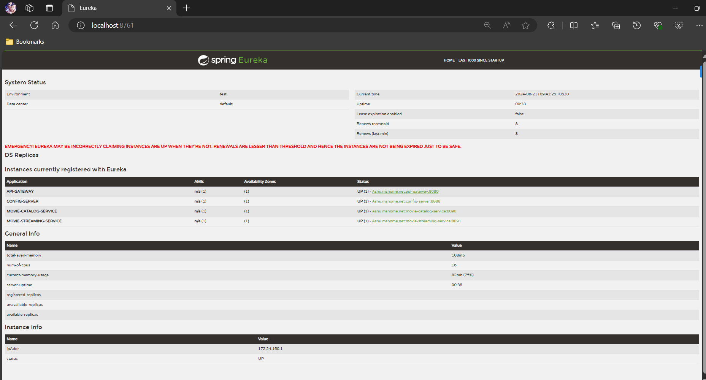

# Eureka Service Registry

Dependencies: 

```
<dependency>
			<groupId>org.springframework.cloud</groupId>
			<artifactId>spring-cloud-starter-netflix-eureka-client</artifactId>
		</dependency>


<properties>
		<java.version>21</java.version>
		<spring-cloud.version>2023.0.3</spring-cloud.version>
	</properties>


        <dependencyManagement>
		<dependencies>
			<dependency>
				<groupId>org.springframework.cloud</groupId>
		<artifactId>spring-cloud-dependencies</artifactId>
		<version>${spring-cloud.version}</version>
				<type>pom</type>
				<scope>import</scope>
			</dependency>
		</dependencies>
	</dependencyManagement>


  
```

Note : spring-cloud.version check it out the exact support version from  https://spring.io/projects/spring-cloud


### Application.properties
```

spring.application.name=service-registry


server.port=8761
eureka.instance.hostname=localhost
eureka.client.register-with-eureka=false # The server itself does not register with another Eureka server
eureka.client.fetch-registry=false   # The server does not fetch the registry from another Eureka server


Note : 

When setting up and starting the eureka server application:

1. Add @EnableEurekaServer to the main class 
2. it is recommended to set the `server.port` to `8761` and `eureka.instance.hostname` to `localhost` and `eureka.client.register-with-eureka` to `false` 

```
## Connecting services to Eureka Server

1. add dependency to pom.xml
```

    <dependency>
			<groupId>org.springframework.cloud</groupId>
			<artifactId>spring-cloud-starter-netflix-eureka-client</artifactId>
		</dependency>


    <properties>
		<java.version>21</java.version>
		<spring-cloud.version>2023.0.3</spring-cloud.version>
	    </properties>

        <dependencyManagement>
		<dependencies>
			<dependency>
				<groupId>org.springframework.cloud</groupId>
		<artifactId>spring-cloud-dependencies</artifactId>
		<version>${spring-cloud.version}</version>
				<type>pom</type>
				<scope>import</scope>
			</dependency>
		</dependencies>
	</dependencyManagement>

```

2.  Add the @EnableDiscoveryClient to the main class

```
@SpringBootApplication
@EnableDiscoveryClient
public class MainApplication {

	public static void main(String[] args) {
		SpringApplication.run(MainApplication.class, args);
	}
	
	
}
```

3. add propertie to application.properties
```
eureka.client.serviceUrl.defaultZone=http://localhost:8761/eureka

```
- Post setting up Eureka Server and connecting services to Eureka Server:




## Eureka Server Overview


- Eureka Server is a service registry and discovery server used in microservices architectures. It is part of the Netflix OSS suite and provides a central place where microservices can register themselves and discover other services. It helps in managing the dynamic nature of microservices and simplifies inter-service communication.


- Key Responsibilities of Eureka Server

- Service Registration: Microservices register themselves with the Eureka Server when they start up.
- Service Discovery: Microservices query the Eureka Server to find the locations of other services.
- Health Monitoring: Periodically checks the health of registered services and removes those that are no longer healthy.
- Load Balancing: Provides information about available instances of services, aiding in client-side load balancing.
- How Eureka Server Works
- Service Registration: Each microservice instance registers with the Eureka Server by providing metadata such as hostname, port, and health check information.
- Service Discovery: Other microservices query the Eureka Server to get a list of available instances of a service.
- Heartbeat Mechanism: Registered services send periodic heartbeats to the Eureka Server to signal that they are still alive.
- Service Removal: If a service fails to send a heartbeat within a specified period, it is considered unavailable and removed from the registry.


## Eureka Service Discovery

- Eureka is a service registry, allowing services to register themselves so they can be discovered by other services. This is particularly useful in a microservices architecture where services need to find and communicate with each other dynamically.

1. eureka.client.fetch-registry Property

- Purpose: This property configures whether the Eureka client (your application) should fetch the registry of services from the Eureka server.
- Default Value: true, meaning by default, the application will fetch the registry from the Eureka server.
When Set to false: The application will not fetch the registry from the Eureka server.
 This is typically used in two scenarios:
- Standalone Server Mode: If your application is acting as a standalone Eureka server and doesn't need to discover other services.
- Edge Cases: In certain configurations where you might not want the application to be aware of other registered services.

- Use Cases

-  Eureka Server: When setting up a Eureka server, you often set eureka.client.fetch-registry=false to indicate that the server itself doesn't need to fetch the registry from another Eureka server. Instead, it maintains its own registry.

- Client Applications: For most client applications that need to discover other services, you would leave this property as true (or omit it, since true is the default).