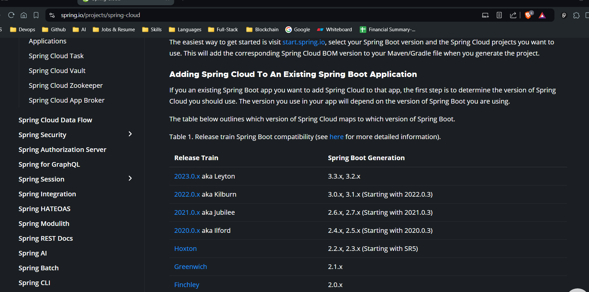

## Service Registry (Framework - Eureka by netflix) : 
-  Registring services, api gateway, config server ....

Eureka Server/service registry is a component of the Spring Cloud Netflix stack used for service discovery in a microservices architecture. It allows services to find and communicate with each other without hardcoding their addresses.


- Key Concepts

- Service Registry: The Eureka Server maintains a registry of all the services and their instances. Each service registers itself with the Eureka Server upon startup and periodically sends heartbeat messages to indicate that it is still alive.

- Service Discovery: Services query the Eureka Server to find other services. This allows services to discover the location of other services dynamically, enabling them to communicate with each other.

- Setting Up Eureka Server

- Add Dependencie pom.xml :

```
        <dependency>
		<groupId>org.springframework.cloud</groupId>
        <artifactId>spring-cloud-starter-netflix-eureka-server</artifactId>
		</dependency>

```
### Enable Eureka Server: Annotate your Spring Boot application class with @EnableEurekaServer.

```

@SpringBootApplication
@EnableEurekaServer
public class SampleApplication {
    public static void main(String[] args) {
        SpringApplication.run(EurekaServerApplication.class, args);
    }
}


```
### Configuration

```

server.port=8761
#recommended post for eureka server

#need to provide host name for eureka server 
eureka.instance.hostname=localhost
#as eureka server is running on localhost i.e my own system


# we want eureka to not to register with eureka server i,e with itself
eureka.client.register-with-eureka=false
 # The server itself does not register with another Eureka server
eureka.client.fetch-registry=false
 # The server does not fetch the registry from another Eureka server


```

### Registering other services to the eureka service

- Add  @EnableDiscoveryClient annotation
 to the main class 

```
@SpringBootApplication
@EnableDiscoveryClient
public class MovieCatalogServiceApplication {

	public static void main(String[] args) throws IOException, InterruptedException {
		
		SpringApplication.run(MovieCatalogServiceApplication.class, args);
	}

}


```
- Configuration in app.prop 

```


eureka.client.serviceUrl.defaultZone=http://localhost:8761/eureka

```

- post registering service registry will look like this 

